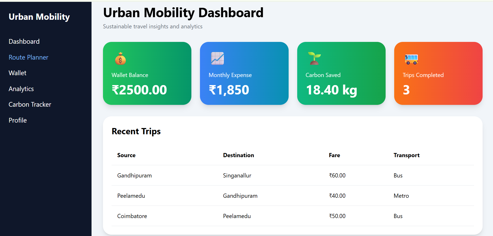
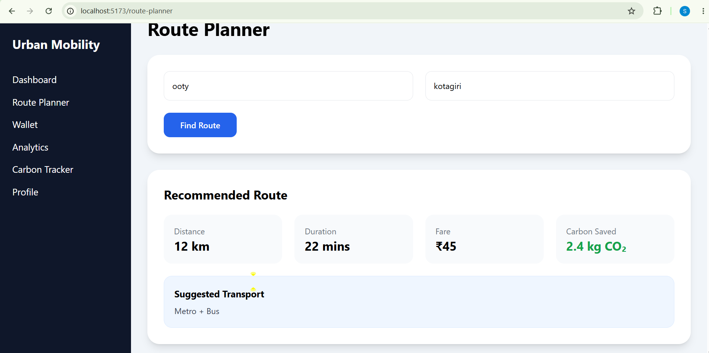
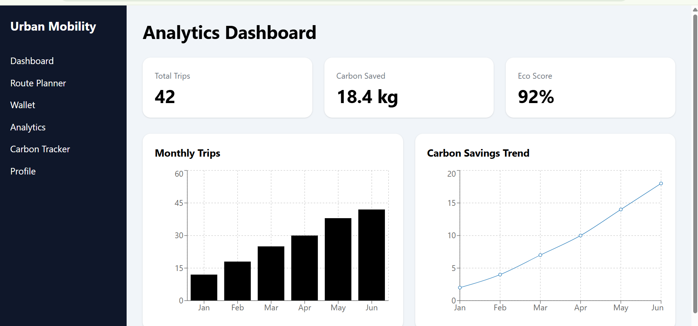
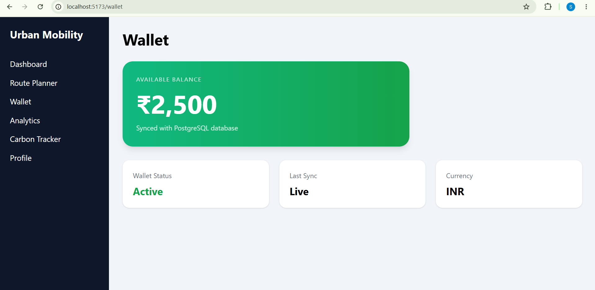
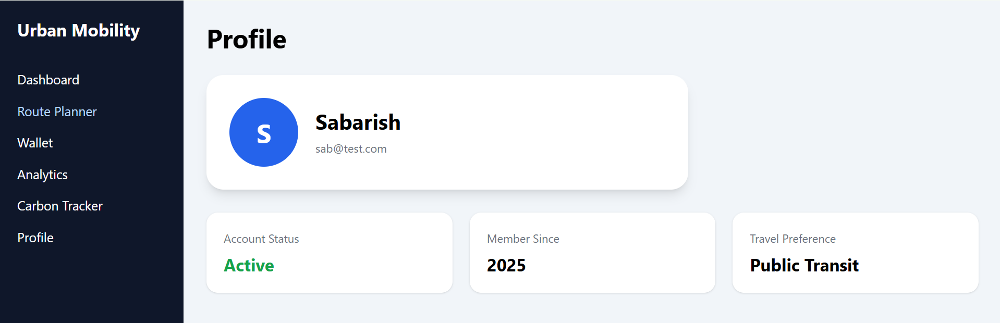

# Urban Mobility Platform

## Overview

Urban Mobility Platform is a full-stack web application designed to promote sustainable urban transportation. It helps users plan routes, manage travel expenses, track carbon savings, and analyze travel patterns.

---

## Features

- Smart Route Planning
- Wallet Management
- Travel Analytics
- Carbon Footprint Tracking
- User Profile Management
- Dashboard Insights
- Recent Trip Tracking

---

## Tech Stack

### Frontend

- React
- Vite
- Tailwind CSS
- Axios
- Recharts

### Backend

- Node.js
- Express.js

### Database

- PostgreSQL

---

## Installation

### Backend

```bash
cd backend
npm install
npm run dev
```

### Frontend

```bash
cd frontend
npm install
npm run dev
```

---
## Screenshots

### Dashboard


### Route Planner


### Analytics


### Wallet


### Carbon Tracker


### Profile



## Future Enhancements

- Google Maps Integration
- Real-time Route Optimization
- AI-Based Route Recommendations
- Payment Gateway Integration
- Authentication & Authorization

---

## Author

Samuktha